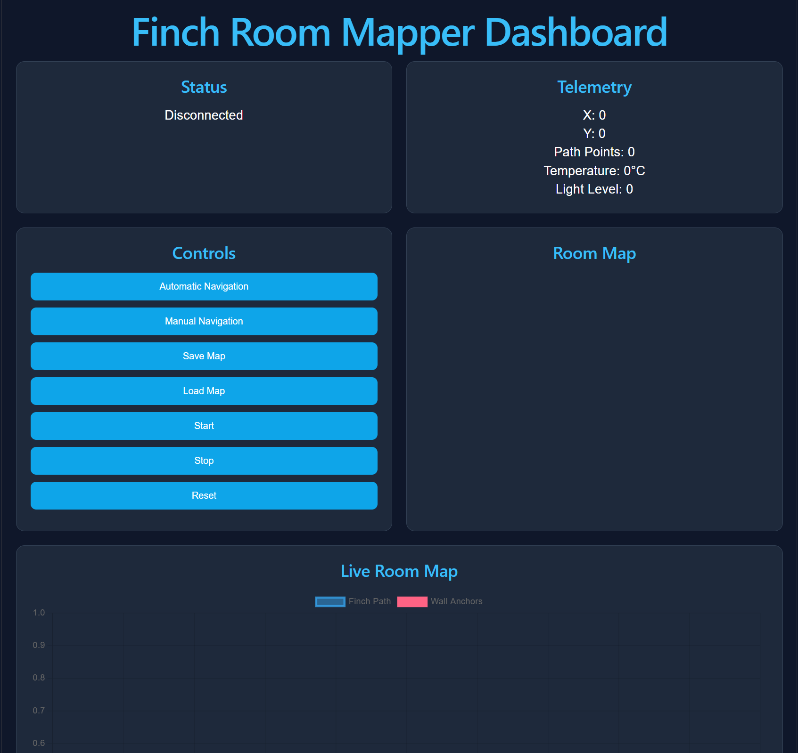

Project Members:
Christian Blair
Armaan Yazdani
William Chen

Project Name: Room Mapper
Project Details: Uses Finch 2.0 to complete a full cycle around the edge of a room and record coordinates to display on a web app.
Makes use of a PID Controller to ensure optimal accuracy while running. Currently uses encoders to find the bearing instead of compass as it was broken. Can optionally be configured to use compass for bearings, hardware allowing. 
The backend app connects to the finch via the bluebird connector app, provided by BirdBrain Technologies. 
The frontend React web app communicates with the backend to issue instructions and receive data to display. 

Frontend Web App:

